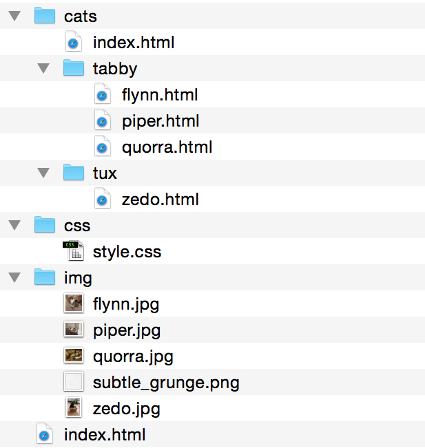

#READ ME

# Site Architecture

The purpose of this exercise is to have you organize and link to the files accordingly.

Included in this file are the following files you will work with:

- cats-index.html
- flynn.html
- flynn.jpg
- index.html
- piper.html
- piper.jpg
- quorra.html
- quorra.jpg
- style.css
- subtle-grunge.png
- zedo.html
- zedo.jpg

(Please disregard site-architecure.png and README.md; these are in the repo for instructions only.)

## Here's what you need to do

**NOTE: You may not re-name files or move them into a different directory structure other than what is displayed here. Keep all files within the `site-architecture` directory.**

1. Organize the files so they are structured as follows:

- cats/
  - index.html (renamed from cats-index.html)
  - tabby/
    - flynn.html
    - piper.html
    - quorra.html
  - tux/
    - zedo.html
- css/
  - style.css
- img/
  - flynn.jpg
  - piper.jpg
  - quorra.jpg
  - subtle_grunge.png
  - zedo.png
- index.html

2. Open each HTML file. Find the tags which have properties such as `href` (for links and the css file) or `src` (for images) and link them accordingly. Use **relative paths**.

  You do not have to understand what is going on in the CSS file, but you have to make it so the styles appear on the web page.

3. If you finish that, can you figure out how to fix the style sheet will include the `subtle-grunge.png` as a background?

  In style.css, look on line 4 for: `background: url("");`

  What is the path to `subtle-grunge.png`?

## How to tackle the project

First, organize your files. If you do not organize the files, you can not move on to step 2.

Work with each file one-by-one. Do not assume all files will have the same paths. Yes, patterns may develop, but make sure you are linking to the right images, files.

## Why isn't X working?

I'm around to help and answer questions, but try working through the problem with your pair first.

Some things to ask yourselves: Are your file names correct? Are you trying to 'go forward' into a path which does not exist? Are there typos?

Remember, you can always refer to your notes or any resources made available to you in the GitHub class repo.

Good luck!
